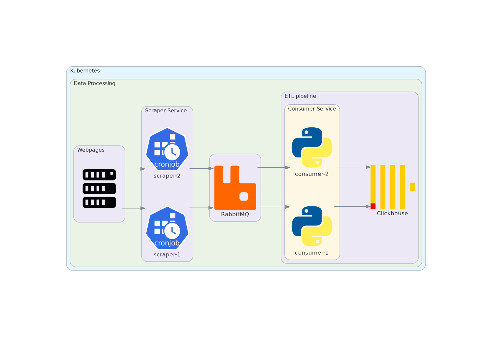

# kscraper

> **Work in progress** — core scraper service is functional; ETL, consumer, and API services are under development.

A distributed web scraping platform where scraping jobs are defined via YAML configuration files. Scrapers run as Kubernetes CronJobs, push data into a RabbitMQ queue, and an ETL pipeline consumes it into ClickHouse. A Claude-powered API layer then allows natural language querying of the collected data.

## Architecture

```
Websites → Scraper CronJobs → RabbitMQ → Consumer/ETL → ClickHouse → Claude API
```

All services run inside Kubernetes and will be deployed via a Helm chart.



## Services

| Service | Status | Description |
|---|---|---|
| `services/scraper` | In progress | Scrapes websites based on YAML config, will publish to RabbitMQ |
| `services/queue-consumer` | Planned | Consumes messages from RabbitMQ |
| `services/etl` | Planned | Transforms and loads data into ClickHouse |
| `services/api` | Planned | Claude-powered API for querying ClickHouse data |
| `packages/shared` | Planned | Shared utilities across services |

## Tech Stack

- **Language:** Python 3.12+
- **Package manager:** [uv](https://docs.astral.sh/uv/) (workspace monorepo)
- **Scraping:** `beautifulsoup4`, `requests`
- **Message broker:** RabbitMQ (quorum queues)
- **Database:** ClickHouse *(planned)*
- **AI:** Claude API *(planned)*
- **Infrastructure:** Docker, Kubernetes, Helm *(planned)*
- **Linting/formatting:** ruff
- **Testing:** pytest

## Getting Started

### Prerequisites

- [Docker](https://docs.docker.com/get-docker/) and Docker Compose
- [uv](https://docs.astral.sh/uv/getting-started/installation/)

### Run locally with Docker Compose

```bash
# Copy environment config
cp .env.example .env

# Start the scraper and RabbitMQ
docker compose up -d
```

RabbitMQ management UI is available at `http://localhost:15672` (credentials from `.env`).

### Run scraper without Docker

```bash
uv sync
uv run services/scraper/main.py
```

### Run tests

```bash
uv run pytest
```

### Lint and format

```bash
uv run ruff check .
uv run ruff format .
```

## Scraper Configuration

Each scraper job is driven by a `config.yaml` file. This defines the target URL, pagination behaviour, and which fields to extract.

```yaml
site:
  url: "https://books.toscrape.com"
  pagination:
    pattern: "{url}/catalogue/page-{page}.html"
    limiter: 1          # number of pages to scrape (0 = all)
  fields:
    title:
      tag: "a"
      attribute: "title"  # extract an HTML attribute value
    price:
      tag: "p"
      class: "price_color"
      text: true          # extract inner text
      remove: "£"         # strip this string from the result
```

### Field options

| Key | Type | Description |
|---|---|---|
| `tag` | string | HTML tag to match |
| `class` | string | CSS class to filter by |
| `attribute` | string | Extract an attribute value (e.g. `href`, `title`) |
| `text` | bool | Extract inner text content |
| `remove` | string | Remove this substring from the extracted value |

## Environment Variables

Copy `.env.example` to `.env` and adjust as needed.